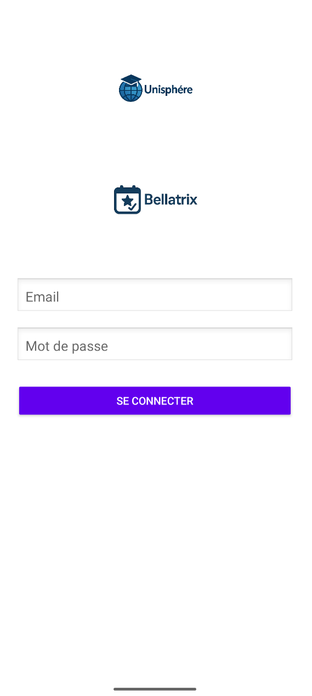
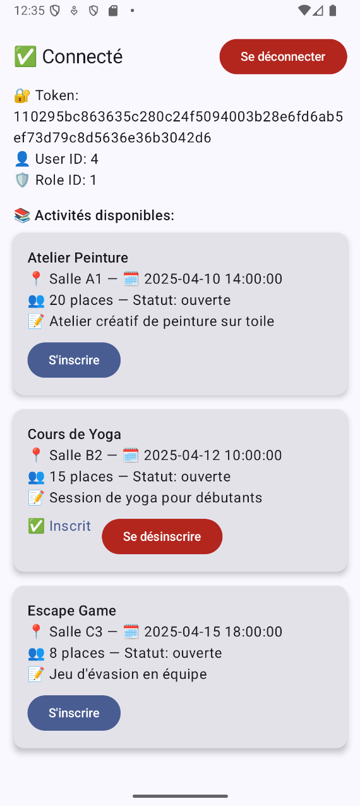

# 📱 Bellatrix Front – Application Android

Application Android native développée avec **Android Studio** et **Jetpack Compose**, permettant aux utilisateurs de consulter et réserver des activités proposées par une organisation via une API REST Laravel.

---

## ✨ Fonctionnalités

- 🔐 **Connexion sécurisée** (token JWT)
- 👤 **Affichage des informations utilisateur** (ID, rôle, token)
- 📅 **Liste des activités** disponibles
- ✅ **Réservation** à une activité
- ❌ **Annulation d'une réservation**
- 🔁 UI réactive (Jetpack Compose)
- 🚪 **Déconnexion** simple et claire

---

## 🧱 Architecture

- **Kotlin** (Jetpack Compose)
- **OkHttp** pour les appels réseau
- **MVC simplifié**
- API REST

---

## 🚀 Lancement rapide

### Prérequis

- Android Studio (Hedgehog ou + recommandé)
- Emulator ou appareil physique
- API fonctionnelle (hébergée avec Laragon par ex.)

### Étapes

1. Clone le repo :
   ```bash
   git clone https://github.com/ton-compte/bellatrix-front.git
   ```

2. Ouvre le projet avec Android Studio.

3. Assure-toi que l’API backend tourne sur `http://10.0.2.2/bellatrix-backend/public`

4. Lance l’application sur un émulateur ou appareil.

---

## 🔧 Configuration de l’API

Dans `MainActivity.kt`, l'URL de base est :

```kotlin
private val baseUrl = "http://10.0.2.2/bellatrix-backend/public"
```

➡️ `10.0.2.2` permet d'accéder au `localhost` depuis l'émulateur Android.

---

## 🖼️ Interface

| Écran Login                            | Écran Principal                              |
|----------------------------------------|----------------------------------------------|
|        |                |

---

## 📦 Structure du projet

```
├── MainActivity.kt       # Écran principal (liste des activités, réservations)
├── LoginActivity.kt      # Connexion utilisateur
├── activity_login.xml    # Interface XML du login
├── res/drawable          # Logos, icônes
├── AndroidManifest.xml   # Déclaration des activités
```

---

## 🧪 Test des fonctionnalités

- ✅ Login : `jp@free.fr` / `root`
- ✅ Réservation
- ✅ Désinscription
- ✅ Affichage dynamique des activités

---

## 🧠 Dépendances clés

| Librairie      | Rôle                     |
|----------------|--------------------------|
| OkHttp         | Requêtes réseau          |
| Jetpack Compose| UI moderne               |
| Material 3     | Composants visuels       |

---
